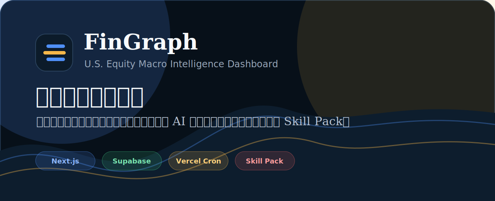

# FinGraph · 美股金融分析图谱



FinGraph is a U.S. equity-centered macro-financial intelligence dashboard. It collects source-linked macro data, market indicators, official RSS feeds, filings, public databases, and embedded market information pages, then maps them into a nine-layer reasoning framework for U.S. stock market analysis.

The product is designed for beginners as much as advanced users: instead of assuming the user already knows how to ask financial questions, FinGraph exports a complete Skill Pack that teaches an AI model how to explain the market layer by layer, cite original links, and suggest useful follow-up questions.

## Core Idea

Many financial dashboards show data, but they do not explain how a beginner should connect that data to a market question. FinGraph organizes evidence around one practical problem:

> How do current macro, policy, fiscal, industry, corporate, geopolitical, social, and market signals affect U.S. equities?

FinGraph turns that problem into three connected layers:

- **Evidence layer**: official APIs, public datasets, RSS, filings, market data, and source links.
- **Reasoning layer**: the FinGraph nine-layer macro framework and relation topology.
- **Export layer**: ZIP/TXT Skill Pack exports that can be pasted into another AI model for a detailed report.

## Features

- **Dashboard for U.S. equity macro analysis**: daily summary, health scores, events, market indicators, fiscal/social pressure, geopolitical signals, external information terminals, and TradingView chart embeds.
- **Real source links everywhere**: events and indicators keep original URLs so users can verify the evidence.
- **Supabase-backed live data mode**: collected rows are persisted and shown only after real data exists.
- **Scheduled collection**: Vercel Cron can call the collector endpoint daily.
- **Skill Pack export**: export as ZIP, download TXT, or copy TXT directly to clipboard.
- **Beginner-friendly AI prompt**: exports ask the downstream AI to generate a U.S. stock market macro report, explain every layer, and provide follow-up question examples.

## Nine-Layer Framework

FinGraph maps evidence into a structured topology:

1. **Currency / liquidity layer**: dollar system, liquidity, funding pressure.
2. **Central-bank layer**: Fed policy, inflation reaction function, real rates.
3. **Fiscal layer**: Treasury supply, deficit, debt service, fiscal credibility.
4. **Industry layer**: AI, semiconductors, energy, banks, manufacturing, supply chains.
5. **Corporate layer**: earnings, margins, revenue growth, buybacks, guidance.
6. **Geopolitical layer**: sanctions, wars, shipping risk, export controls, energy routes.
7. **Social layer**: labor market, wages, consumer stress, housing, political pressure.
8. **Market layer**: valuation, breadth, volatility, credit, positioning, sentiment.
9. **Asset-decision layer**: SPY, QQQ, TLT, DXY, gold, oil, sectors, and cash.

## Tech Stack

- Next.js 16 + React 19 + TypeScript
- Tailwind CSS
- Supabase Postgres
- Vercel Cron and Vercel deployment
- Cloudflare custom domain

## Data Sources

Implemented or registered sources include:

- FRED
- BLS Public Data API
- BEA API
- Federal Reserve RSS
- U.S. Treasury Fiscal Data
- SEC EDGAR
- GDELT
- GDACS Disaster Alerts
- World Bank Indicators
- Stooq Market Data
- U.S. Energy Information Administration
- CFTC Commitments of Traders
- Alpha Vantage
- Twelve Data
- Brave Search API
- ReliefWeb candidate source

Some sources require API keys. When a key is missing, collectors skip that source instead of generating fake data.

## Environment Variables

Create `.env.local` from `.env.example` and configure the variables you need.

Required for Supabase live mode:

```bash
NEXT_PUBLIC_SUPABASE_URL=
SUPABASE_SERVICE_ROLE_KEY=
```

Recommended collector variables:

```bash
CRON_SECRET=
SEC_USER_AGENT=
BLS_API_KEY=
FRED_API_KEY=
BEA_API_KEY=
EIA_API_KEY=
ALPHA_VANTAGE_API_KEY=
TWELVE_DATA_API_KEY=
BRAVE_SEARCH_API_KEY=
RELIEFWEB_APP_NAME=
```

Public browser-side Supabase keys should only be used where intended. Keep service-role and secret keys in server-only environments such as Vercel environment variables.

## Local Development

```bash
npm install
npm run dev
```

Useful checks:

```bash
npm run typecheck
npm run validate:events
```

## Supabase Setup

Run the migrations in a Supabase SQL editor:

```txt
supabase/migrations/001_init.sql
supabase/migrations/002_real_data_pipeline.sql
```

Optional demo seed:

```txt
supabase/seeds/seed.sql
```

To confirm data mode:

```txt
/api/health
```

The dashboard uses demo seed data until at least one real event or indicator has been collected and persisted.

## Data Collection

Manual trigger:

```bash
curl -H "Authorization: Bearer YOUR_CRON_SECRET" \
  https://your-domain.com/api/cron/collect
```

Vercel Cron is configured through `vercel.json`. The production goal is to collect once per day around U.S. midday / New York market context.

## Skill Pack Export

Export endpoints:

```txt
/api/export/skill-pack?days=14&format=zip&prompt=zh
/api/export/skill-pack?days=14&format=txt&prompt=en
```

Options:

- `format=zip | txt`
- `prompt=zh | en`

The exported content includes:

- `SKILL.md`
- nine-layer knowledge base
- relation topology
- compact context with selected events, indicator summaries, source links, and relation notes
- final user prompt

The final prompt asks the downstream AI to produce a complete U.S. equity macro report, explain each layer in detail, cite original source links, and provide beginner follow-up questions from multiple angles.

## Deployment

1. Create a Supabase project.
2. Run migrations.
3. Deploy the repository to Vercel.
4. Add environment variables in Vercel.
5. Configure the Vercel domain.
6. Point the Cloudflare DNS record to Vercel.
7. Trigger `/api/cron/collect` once.
8. Open `/api/health` and confirm `liveDataReady: true`.

## Repository

Source code: [github.com/gintmr/FinGraph](https://github.com/gintmr/FinGraph)

## Disclaimer

FinGraph is for education, research, and decision support. It is not personalized investment advice. Always verify original sources before relying on any conclusion.
