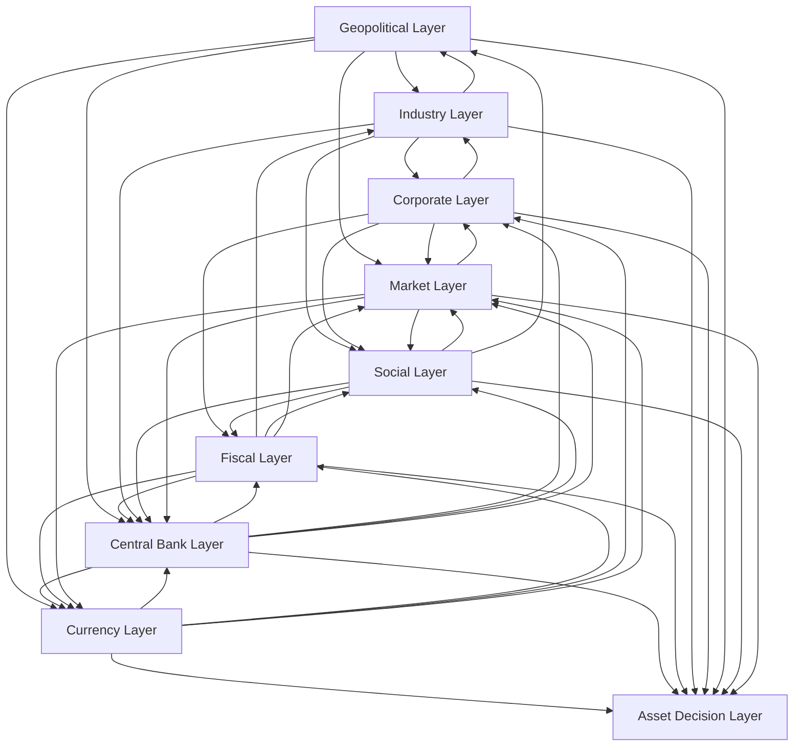

# FinGraph Relation Topology

## Purpose

This reference explains how the nine FinGraph layers connect. The goal is to move from isolated headlines to causal reasoning and then to asset-level implications.

## High-Level Topology



## Core Causal Channels

### 1. Interest-rate channel

```txt
Inflation or Fed communication
  -> expected policy rate
  -> Treasury yields and real yields
  -> discount rates
  -> equity valuation
  -> Nasdaq/QQQ sensitivity
```

Use this channel when events involve CPI, PCE, labor data, Fed speeches, FOMC decisions, or bond yields.

### 2. Dollar-liquidity channel

```txt
Fed policy or global risk stress
  -> dollar strength and dollar funding conditions
  -> global liquidity
  -> emerging markets, commodities, multinational earnings
  -> risk appetite
```

Use this channel when events involve DXY, foreign exchange stress, reserve flows, Treasury demand, or safe-haven behavior.

### 3. Fiscal-supply channel

```txt
Deficit expansion or debt issuance
  -> Treasury supply
  -> auction demand and term premium
  -> long-term yields
  -> mortgage rates, corporate borrowing, equity multiples
```

Use this channel when events involve Treasury refunding, debt ceiling, fiscal deficits, tax receipts, or interest expense.

### 4. Energy-inflation channel

```txt
War, sanctions, OPEC, shipping disruption
  -> oil/gas supply risk
  -> energy prices
  -> headline inflation and inflation expectations
  -> Fed reaction function
  -> yields, dollar, equities
```

Use this channel when events involve the Middle East, Russia, Red Sea, oil inventories, natural gas, or energy sanctions.

### 5. Supply-chain channel

```txt
Geopolitical restrictions or industrial shock
  -> supply-chain disruption
  -> input costs and delivery delays
  -> margins and inflation
  -> earnings revisions and policy pressure
```

Use this channel when events involve chips, tariffs, export controls, shipping, rare earths, or manufacturing bottlenecks.

### 6. Productivity channel

```txt
Technology adoption or infrastructure investment
  -> productivity growth
  -> better margins or lower inflation pressure
  -> stronger real growth
  -> higher sustainable earnings
  -> equity support
```

Use this channel when events involve AI, automation, semiconductor capacity, energy infrastructure, or capital deepening.

### 7. Corporate-earnings channel

```txt
Demand, margins, pricing power, capex
  -> revenue and earnings expectations
  -> free cash flow
  -> valuation support or pressure
  -> index performance
```

Use this channel when events involve earnings reports, guidance, cloud growth, AI monetization, buybacks, or margins.

### 8. Social-policy feedback channel

```txt
Household stress or inequality
  -> political pressure
  -> fiscal transfers, taxes, regulation, tariffs
  -> deficits, margins, inflation, investment incentives
  -> market repricing
```

Use this channel when events involve wages, housing, consumer delinquencies, elections, inequality, or labor unrest.

### 9. Risk-premium channel

```txt
Uncertainty shock
  -> higher risk premium
  -> lower valuation multiples
  -> wider credit spreads
  -> lower liquidity and risk appetite
```

Use this channel when events are uncertain, fast-moving, hard to quantify, or geopolitical.

## Layer Adjacency Map

Currency layer:

- Directly affects central banks, fiscal sustainability, corporate translation effects, commodities, and market liquidity.
- Receives pressure from Fed policy, fiscal credibility, geopolitical sanctions, and global capital flows.

Central bank layer:

- Directly affects currency, bond yields, liquidity, credit, equity valuation, and unemployment.
- Receives pressure from inflation, labor markets, fiscal deficits, energy shocks, and financial instability.

Fiscal layer:

- Directly affects Treasury supply, interest rates, industrial policy, household transfers, and market confidence.
- Receives pressure from social demands, defense needs, recession, interest expense, and political constraints.

Industry layer:

- Directly affects productivity, inflation, corporate margins, employment, and supply-chain resilience.
- Receives pressure from fiscal subsidies, geopolitical restrictions, energy costs, and corporate investment.

Corporate layer:

- Directly affects equity markets, employment, tax receipts, innovation, and investment.
- Receives pressure from rates, wages, demand, regulation, trade policy, and input costs.

Geopolitical layer:

- Directly affects energy, supply chains, sanctions, currencies, risk premium, and defense spending.
- Receives pressure from social politics, resource competition, technological rivalry, and alliance shifts.

Social layer:

- Directly affects elections, fiscal policy, consumption, labor costs, and political risk.
- Receives pressure from inflation, unemployment, housing, asset prices, wages, and inequality.

Market layer:

- Directly affects household wealth, corporate financing, central-bank financial conditions, and capital flows.
- Receives pressure from all other layers.

Asset decision layer:

- Directly translates the first eight layers into implications for QQQ, Nasdaq, SPY, TLT, DXY, gold, oil, credit, and cash.
- Receives pressure from all other layers and feeds back into markets through positioning, flows, and risk appetite.
- Should not create unsupported conclusions; it should state which facts support the asset view and which future evidence would invalidate it.

## Event Classification Algorithm

For each event:

1. Identify the direct layer: where did the event originate?
2. Identify affected nodes: rates, dollar, debt, energy, earnings, employment, etc.
3. Choose the likely transmission channels from the list above.
4. Assign related layers after propagation, not only the origin layer.
5. Estimate direction:
   - positive: improves growth, earnings, liquidity, or confidence.
   - negative: worsens inflation, rates, margins, risk premium, or financial stress.
   - neutral: no clear market effect.
   - mixed: positive for one layer but negative for another.
   - uncertain: evidence is insufficient or conflicting.
6. Estimate strength:
   - 1: background noise.
   - 2: minor but relevant.
   - 3: meaningful, should be monitored.
   - 4: important market or policy signal.
   - 5: regime-changing or crisis-level.
7. Estimate horizon:
   - short: days to weeks.
   - medium: months.
   - long: years.
   - structural: multi-year to decade-scale.

## Common Propagation Examples

### Hot CPI print

```txt
Central bank layer -> Market layer -> Corporate layer -> Social layer
```

Interpretation: Hot inflation may delay rate cuts, raise real yields, pressure growth-stock valuations, increase borrowing costs, and worsen household affordability.

### Strong AI chip demand

```txt
Corporate layer -> Industry layer -> Market layer -> Fiscal layer
```

Interpretation: Strong chip demand can support earnings, validate AI infrastructure investment, lift Nasdaq sentiment, and eventually affect tax receipts and industrial policy.

### Middle East oil shock

```txt
Geopolitical layer -> Industry layer -> Central bank layer -> Market layer
```

Interpretation: Supply risk can raise oil prices, lift headline inflation, make central banks more cautious, and pressure equities through higher yields and risk premiums.

### Weak Treasury auction

```txt
Fiscal layer -> Market layer -> Central bank layer -> Currency layer
```

Interpretation: Weak demand for Treasuries can push yields higher, tighten financial conditions, pressure equity multiples, and affect dollar confidence depending on context.

### Rising consumer delinquencies

```txt
Social layer -> Corporate layer -> Market layer -> Fiscal layer
```

Interpretation: Household stress can weaken consumption, hurt corporate earnings, widen credit spreads, and increase pressure for fiscal intervention.
